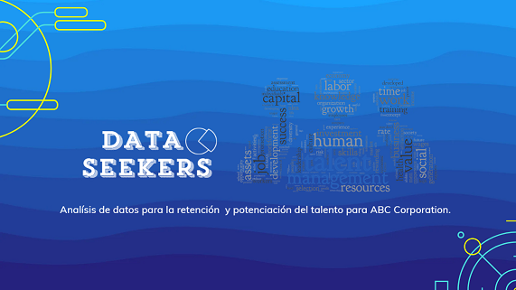

# Proyecto 3: Análisis de Datos para Mejorar la Retención de Empleados en ABC Corporation

## Descripción

**¿Quién es ABC Corporation?**  
Esta empresa, fundada en 1980 en California, es una consultora tecnológica especializada en inteligencia artificial y aprendizaje automático. Se enfoca en automatizar y optimizar procesos empresariales a través de tecnologías avanzadas. Su equipo multidisciplinario, compuesto por expertos en diversas áreas, permite ofrecer soluciones personalizadas adaptadas a las necesidades de cada cliente. En su último proyecto, la empresa desarrolló una plataforma de selección inteligente que analiza automáticamente CVs, identifica habilidades clave y clasifica candidatos, además de implementar un sistema de recomendación para apoyar a los reclutadores.

**Equipo Data Seekers**  

En un entorno empresarial competitivo, la toma de decisiones fundamentadas es clave para el éxito a largo plazo. La satisfacción y retención de empleados son factores cruciales para cualquier organización, ya que impactan la productividad y rentabilidad. Con el fin de reducir la rotación de personal y aumentar la satisfacción laboral, la empresa **ABC Corporation** nos ha contratado para llevar a cabo un proyecto de análisis de datos y experimentación A/B.

Nuestro objetivo es identificar los factores que influyen en estos aspectos y proporcionar información útil que guíe las decisiones estratégicas de la empresa.

## Fases del Proyecto

1. **Análisis Exploratorio de Datos (EDA)**:
   - Exploramos el conjunto de datos de los empleados, revisamos las columnas disponibles y preparamos los datos para el análisis posterior.  
2. **Transformación de Datos**:
   - Limpiamos y transformamos los datos, resolviendo problemas como valores inconsistentes, valores faltantes, y conversiones de tipos de datos.

3. **Creación de la Base de Datos (BBDD)**:
   - Diseñamos una base de datos para almacenar los datos de los empleados de forma eficiente, utilizando SQL y herramientas de Python.

4. **A/B Testing**:
   - Dividimos a los empleados en dos grupos según su nivel de satisfacción laboral para analizar la relación con la rotación. Comparamos las tasas de rotación de ambos grupos y validamos la hipótesis de que los empleados insatisfechos tienen más probabilidades de dejar la empresa.

   - También hicimos una comparativa para saber si el salario podía ser un factor influyente a la hora de decidir si irse o no de la empresa, pero esta vez fue negativo. Es decir, este no es un factor influyente.

## Autoría

Este proyecto fue desarrollado por el equipo Data Seekers:

- Marta Hernández
- Verónica Sánchez
- Zoraida Alías
- Rosana Lara
